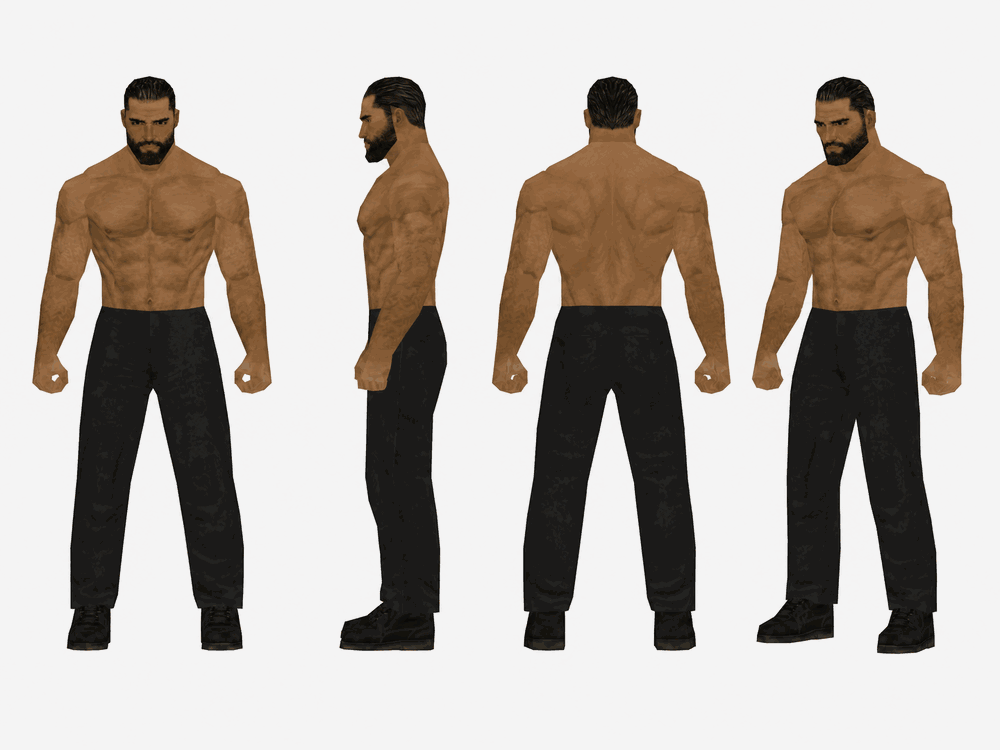

# GIGA Community Engine

An easy creative tool for making recognizable Gigachad images, memes, game-world scenes, storyboards, commercials, and episodes.

You do not need to know prompting.

Tell the Engine what Gigachad is doing. It handles identity, style, camera direction, continuity, approvals, animation prompts, and narrow repairs.

Game-era requests begin with authentic original-platform gameplay grounding whether you choose the era or the Engine chooses it. GIGA then follows the selected build's real geometry, textures, lighting, density, and camera language instead of placing a retro filter over modern rendering.

## What you need

- **A paid ChatGPT plan with Skills available.** On a managed workspace, an admin may need to turn Skills on.
- **ChatGPT image generation** for images and storyboards.
- **A separate video tool** for rendered video. The Engine can prepare prompts for tools such as Seedance, Kling, Sora, or Higgsfield, but those products are separate from ChatGPT.

## Install in ChatGPT

1. Download [giga-community-engine.zip](https://github.com/nosimajtechnology/giga-community-engine/releases/latest/download/giga-community-engine.zip). **Do not unzip it.**
2. In ChatGPT, open **Plugins** → **Skills** → **Create** → **Upload from your computer**, then select the ZIP.
3. Start a new chat.

Use this as your first prompt:

```text
Load the "GIGA Community Engine" skill.
```

Then describe your idea:

```text
Make a PS2-era scene of Gigachad training alone in an old boxing gym.
```

If the result looks right, reply `Approved.` The Engine locks it and moves to the next stage. If something is off, name only the problem:

```text
The face drifted. Keep everything else and restore the approved face.
```

## What you can make

- **CHARACTER** — identity studies and turnarounds
- **STILL** — one finished image
- **MEME** — fast community-native concepts
- **SCENE** — a short visual sequence
- **CLASSIC CINEMATIC** — first frame, storyboard, then animation prompt
- **TRAINING** — fitness, discipline, work, and self-improvement media
- **COMMERCIAL** — fictional products, brands, and ads
- **EPISODE** — four progressive storyboards, with a fifth only when needed

You can name a mode or simply describe the idea and let the Engine choose.

## Canonical PS2 Character Reference

This turnaround is the visual authority for the Engine's PS2/sixth-generation Gigachad model. Preserve the face, hair, beard, physique, proportions, and silhouette; scenes, wardrobe, props, poses, and expressions may change.



## Community use

Community creations are unofficial by default and do not become official Gigachad, $GIGA, or Nosimaj Media canon automatically.

Suggested credit:

> Gigachad source identity associated with Ernest Khalimov and photography by Krista Sudmalis / SLEEK'N'TEARS. Community-created transformation made with the GIGA Community Engine by Nosimaj Media.

Respect the rights of the original subject, photographer, $GIGA community, and any crossover characters. This creative tool does not grant ownership of underlying third-party identity or artwork.

This is a creative-production tool, not financial advice. It does not provide token recommendations, price targets, return promises, or trading claims.

Learn more at [GIGA](https://gigachadsolana.com/) and [Nosimaj Media](https://nosimaj.com).
